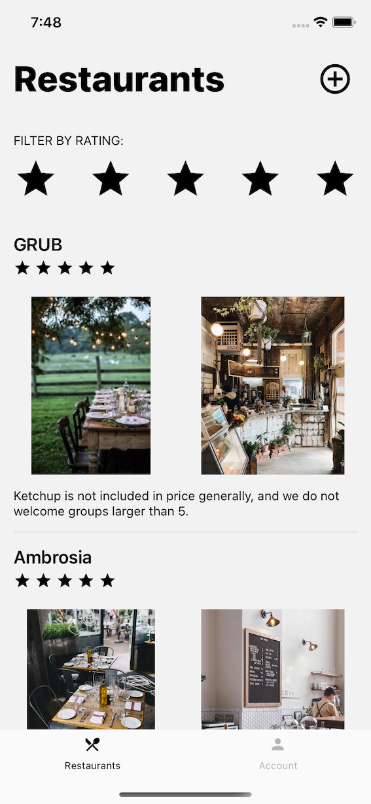

# Restaurant Review

## Project Setup & Folder structure

`server` folder in root contains the node server, that serves app data from it's sqlLite db using graphql.

`restaurants-review-rn-app` folder in root contains the RN app codebase.

`insomnia` folder in `root` contains the json file for Insomnia workspace to test the server.

The React Native app uses context for state management, and graphQL client for making network calls to the server.

## Run & Setup

Navigate to `/server` and run `yarn` and `node index.js` to start the local server.

Navigate to `/restaurants-review-rn-app` and run `yarn` to install node-modules and `cd ios && pod install`.

Run `yarn start` and then `yarn ios` or `yarn android` depending on which devices & simulators you have available.

